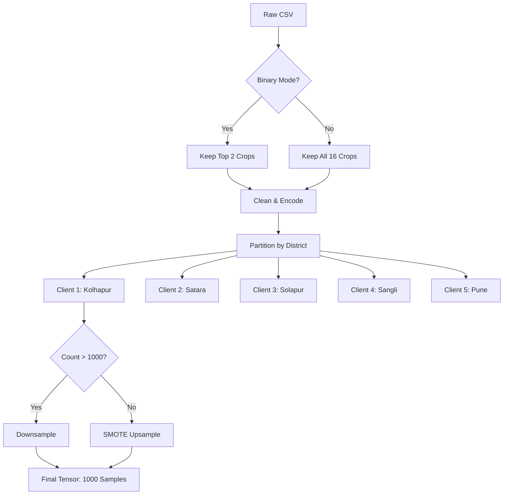

# FLyer Data Pipeline Documentation

## Overall Data Pipeline – High Level View

The FLyer data pipeline transforms raw agricultural data into balanced, privacy-preserving tensors ready for Federated Learning. The process follows a **"Load → Filter → Partition → Balance"** methodology to ensure realistic yet robust training conditions.

1.  **Input Phase**: Ingests raw soil and weather data from the `Kaggle CSV` source.
2.  **Filtration Phase**: Automatically selects the top 2 crops for binary classification, discarding irrelevant classes.
3.  **Global Processing** (Standardization):
    *   **Scaling**: `StandardScaler` applied globally to all feature data *before* partitioning.
    *   **Encoding**: Target labels are encoded globally.
4.  **Federated Partitioning**: Splits data geographically into 5 distinct clients (Non-IID).
5.  **Balancing Engine**: Standardizes every client's dataset to exactly **1000 samples** (SMOTE/Downsampling).
6.  **Tensor Output**: Final reshaping for LSTM.

---

## Detailed Process Breakdown

### 1. Data Ingestion
*   **Source**: `Crop and fertilizer dataset.csv` (Kaggle Dataset for Western Maharashtra).
*   **Raw Features**: Nitrogen, Phosphorus, Potassium, pH, Rainfall, Temperature.
*   **Raw Target**: Crop Name (16 original classes).
*   **Districts**: Kolhapur, Satara, Solapur, Pune, Sangli.

## 2. Preprocessing & Filtering
*   **Multi-Class Classification**:
    *   The pipeline uses **ALL available crops** in the dataset (approx. 16 classes).
    *   No crop filtering is applied.
*   **Feature Cleaning**:
    *   Coerces non-numeric errors to NaN.
    *   Drops rows with missing values.
*   **Label Encoding**:
    *   Converts string labels to integers (0 or 1 for binary).

## 3. Partitioning (Federated Split)
The data is split based on **Geographic Districts** to simulate statistical heterogeneity (Non-IID data).
*   **Client 1** ← Kolhapur
*   **Client 2** ← Satara
*   **Client 3** ← Solapur
*   **Client 4** ← Sangli
*   **Client 5** ← Pune

## 4. Hybrid Balancing Strategy (Target: 1000 Samples)
To ensure equal load across all edge servers, a hybrid balancing approach is applied to *each client individually*:

| Condition | Action | Implementation |
| :--- | :--- | :--- |
| **Samples > 1000** | **Downsample** | Randomly select 1000 samples. |
| **Samples < 1000** | **Upsample** | Use **SMOTE** (Synthetic Minority Over-sampling Technique) to generate synthetic samples based on nearest neighbors. |

**Result**: Every client ends up with exactly **1000 samples**.

## 5. Tensor Formatting
*   **Normalization**: `StandardScaler` applied to features (Mean=0, Std=1).
*   **Splitting**: 80% Training / 20% Testing per client.
*   **Reshaping**: Features reshaped to `(Batch, 1, 6)` for LSTM compatibility.
*   **Output**: PyTorch Tensors (`torch.tensor`).

## Pipeline Diagram

